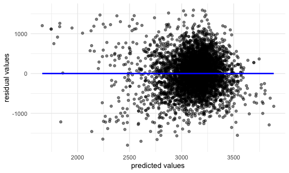
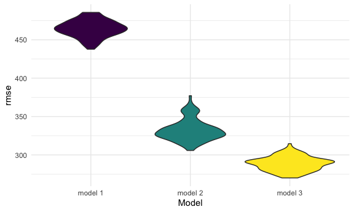
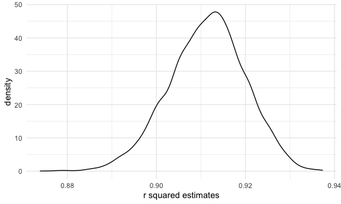
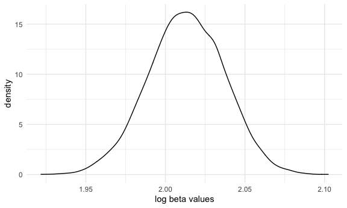

HW 6
================
Tara Ahi
12/4/2021

``` r
library(tidyverse)
```

    ## ── Attaching packages ─────────────────────────────────────── tidyverse 1.3.1 ──

    ## ✓ ggplot2 3.3.5     ✓ purrr   0.3.4
    ## ✓ tibble  3.1.4     ✓ dplyr   1.0.7
    ## ✓ tidyr   1.1.3     ✓ stringr 1.4.0
    ## ✓ readr   2.0.1     ✓ forcats 0.5.1

    ## ── Conflicts ────────────────────────────────────────── tidyverse_conflicts() ──
    ## x dplyr::filter() masks stats::filter()
    ## x dplyr::lag()    masks stats::lag()

``` r
library(modelr)

set.seed(1)
```

# Problem 1

Loading and cleaning the data:

``` r
birthweight_df = 
  read_csv("birthweight.csv") %>% 
  janitor::clean_names() %>% 
  mutate(
    babysex = as.character(babysex),
    bhead = as.numeric(bhead),
    blength = as.numeric(blength),
    bwt = as.numeric(bwt),
    delwt = as.numeric(delwt),
    fincome = as.numeric(fincome),
    frace = as.character(frace),
    gaweeks = as.numeric(gaweeks),
    malform = as.character(malform),
    menarche = as.numeric(menarche),
    mheight = as.numeric(mheight),
    momage = as.numeric(momage),
    mrace = as.character(mrace),
    parity = as.numeric(parity),
    pnumlbw = as.numeric(pnumlbw),
    pnumsga = as.numeric(pnumsga),
    ppbmi = as.numeric(ppbmi),
    ppwt = as.numeric(ppwt),
    smoken = as.numeric(smoken),
    wtgain = as.numeric(wtgain)
  ) 
```

    ## Rows: 4342 Columns: 20

    ## ── Column specification ────────────────────────────────────────────────────────
    ## Delimiter: ","
    ## dbl (20): babysex, bhead, blength, bwt, delwt, fincome, frace, gaweeks, malf...

    ## 
    ## ℹ Use `spec()` to retrieve the full column specification for this data.
    ## ℹ Specify the column types or set `show_col_types = FALSE` to quiet this message.

``` r
sapply(birthweight_df, function(x) sum(is.na()))
#no missing values
```

I’m fitting an initial model that considers birthweight as an outcome
that may depend on gestational age in weeks (`gaweeks`) and family
income (`fincome`).

``` r
fit = lm(bwt ~ gaweeks + fincome, data = birthweight_df)
```

``` r
summary(fit)
summary(fit)$coef
coef(fit)
fitted.values(fit)
```

``` r
fit %>% 
  broom::tidy() %>% 
  select(term, estimate, p.value) %>% 
  knitr::kable(digits = 3)
```

| term        | estimate | p.value |
|:------------|---------:|--------:|
| (Intercept) |  455.109 |       0 |
| gaweeks     |   64.982 |       0 |
| fincome     |    2.206 |       0 |

The intercept is 455, with the coefficient of gestational age in weeks
being about 65 and the coefficient of family income being about 2 *(see
table)*.

### Plot of model residuals against fitted values

``` r
birthweight_df %>% 
  modelr::add_predictions(fit, var = "predictor") %>% 
  modelr::add_residuals(fit, var = "residual") %>% 
  ggplot(aes(x = predictor, y = residual)) +
  geom_point(alpha = 0.5) +
  geom_smooth(se = FALSE, method = "lm", color = "blue") +
  labs(
    x = "predicted values", y = "residual values"
  )
```

    ## `geom_smooth()` using formula 'y ~ x'



The graph shows more outliers to the left of the plot, though the main
cluster is largely in the center. We see an even distribution around 0
for residual values. This is likely a valid model to use in this
analysis.

### Compare models

Model 2: Using length at birth and gestational age as predictors

``` r
fit2 = lm(bwt ~ blength + gaweeks, data = birthweight_df)
```

Model 3: Using head circumfrance, length, sex and interactions

``` r
fit3 = lm(bwt ~ bhead + blength + babysex + bhead * blength + bhead * babysex + blength * babysex + bhead * blength * babysex, data = birthweight_df)
```

#### Cross Validation

``` r
cv_df =
  crossv_mc(birthweight_df, 100) %>% 
  mutate(train = map(train, as_tibble),
         test = map(test, as_tibble)
         )

cv_df = 
  cv_df %>% 
  mutate(
    fit = map(train, ~lm(bwt ~ gaweeks + fincome, data = .x)),
    fit2 = map(train, ~lm(bwt ~ blength + gaweeks, data = .x)),
    fit3 = map(train, ~lm(bwt ~ bhead + blength + babysex + bhead * blength + bhead * babysex + blength * babysex + bhead * blength * babysex, data = .x)),
  ) %>% 
  mutate(
    rmse_fit = map2_dbl(fit, test, ~rmse(model = .x, data = .y)),
    rmse_fit2 = map2_dbl(fit2, test, ~rmse(model = .x, data = .y)),
    rmse_fit3 = map2_dbl(fit3, test, ~rmse(model = .x, data = .y))
  )
```

``` r
cv_df %>% 
  select(starts_with("rmse")) %>% 
  pivot_longer(
    everything(),
    names_to = "model",
    values_to = "rmse",
    names_prefix = "rmse"
  ) %>% 
  mutate(model = fct_inorder(model)) %>% 
  ggplot(aes(x = model, y = rmse)) +
  geom_violin(aes(fill = model)) +
  labs(
    x = "Model",
    y = "rmse"
  ) +
  scale_x_discrete(labels = c("_fit" = "model 1", "_fit2" = "model 2", "_fit3" = "model 3")) +
  theme(legend.position = "none")
```



This gives us a sense of variance in prediction error and compares
prediction error distribution across methods. The graph shows that model
3 is the most optimal one.

# Problem 2

Importing data (code from instructions)

``` r
weather_df = 
  rnoaa::meteo_pull_monitors(
    c("USW00094728"),
    var = c("PRCP", "TMIN", "TMAX"), 
    date_min = "2017-01-01",
    date_max = "2017-12-31") %>%
  mutate(
    name = recode(id, USW00094728 = "CentralPark_NY"),
    tmin = tmin / 10,
    tmax = tmax / 10) %>%
  select(name, id, everything())
```

    ## Registered S3 method overwritten by 'hoardr':
    ##   method           from
    ##   print.cache_info httr

    ## using cached file: ~/Library/Caches/R/noaa_ghcnd/USW00094728.dly

    ## date created (size, mb): 2021-10-05 10:31:06 (7.602)

    ## file min/max dates: 1869-01-01 / 2021-10-31

#### Use 5000 bootstrap samples and, for each bootstrap sample, produce estimates of these two quantities

``` r
set.seed(1)

boot_sample = function(df) {
  sample_frac(df, replace = TRUE)
}

bootstrap_df = 
  data_frame(
    strap_number = 1:5000, 
    strap_sample = rerun(5000, boot_sample(weather_df)))
```

    ## Warning: `data_frame()` was deprecated in tibble 1.1.0.
    ## Please use `tibble()` instead.
    ## This warning is displayed once every 8 hours.
    ## Call `lifecycle::last_warnings()` to see where this warning was generated.

#### Using the 5000 bootstrap estimates, identify the 2.5% and 97.5% quantiles to provide a 95% confidence interval for r^ 2 and log(β̂ 0∗β̂ 1)

##### R squared

``` r
bootstrap_1 = 
  bootstrap_df %>% 
  mutate(
    models = map(strap_sample, ~lm(tmax ~ tmin, data = .x)),
    results = map(models, broom::glance)
  ) %>% 
  select(-strap_sample, -models) %>% 
  unnest(results)

bootstrap_1 %>% 
  janitor::clean_names() %>% 
  summarise(lower_limit = quantile(r_squared, c(0.025)),
            upper_limit = quantile(r_squared, c(0.975))) %>% 
  knitr::kable()
```

| lower\_limit | upper\_limit |
|-------------:|-------------:|
|    0.8936684 |     0.927106 |

**The 95% CI of r^2 is 0.89, 0.93.**

###### Plot the distribution of your estimate

``` r
bootstrap_1 %>% 
  ggplot(aes(x = r.squared)) +
  geom_density() +
  labs(x = "r squared estimates", y = "density")
```



##### log(β̂ 0∗β̂ 1)

``` r
log_b_h = function(df) {
  log(df[1,2]*df[2,2]) %>% 
    tibble() %>% 
    mutate(log_b = .$estimate) %>% 
    select(log_b)
}

bootstrap_2 = 
  bootstrap_df %>% 
  mutate(
    models = map(strap_sample, ~lm(tmax ~ tmin, data = .x)),
         results = map(models, broom::tidy),
         log_b = map(results, log_b_h)) %>% 
        select(-strap_sample, -models) %>% 
        unnest(log_b)

bootstrap_2 %>% 
  janitor::clean_names() %>% 
  summarize(
    lower_limit = quantile(log_b, c(0.025)),
    upper_limit = quantile(log_b, c(0.975))
  ) %>% 
  knitr::kable()
```

| lower\_limit | upper\_limit |
|-------------:|-------------:|
|     1.964949 |     2.058887 |

**The 95% CI of log(β̂ 0∗β̂) is 1.96, 2.06**

###### Plot the distribution of your estimate

``` r
bootstrap_2 %>% 
  ggplot(aes(x = log_b)) +
  geom_density() +
  labs(x = "log beta values", y = "density")
```



Both of the plots are observed to have an approximately normal
distribution.
